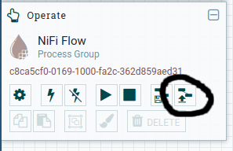
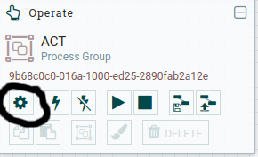

# NIFI

NiFi is used for workflow orchestration, e.g. data import and enrichment.

## Installation

Download [NIFI](https://nifi.apache.org/download.html) and follow the installation instructions on the NiFi site.

Once you can connect to your NiFi instance using a web browser, you can continue with the setup below.

## NiFi Setup

Download the preconfigured [NIFI Template](example-config/scio-act-workflow-2019-11-22.xml).

### Upload template

Click on the upload icon on the left side on your NiFi web application:



and choose the template downloaded in the previous step.

Apply the template to your instance by dragging this icon onto your NiFi desktop:


You show now have two processor groups (ACT and Scio). You can double click on them to see the details for each processor group.

### Add NiFi services

Double click on the ACT processor group and click on the service gear:



In this view, add these services:


You must also start all the services, by click on the lighting symbol at the right.

After installing these services you will need to look for an orange triangle in processors/processor groups and configure them to use the newly installed services.

### Add NiFi home to init script

Edit `/etc/init.d/nifi` to add /usr/local/bin to your path, so the last lines will look like this:

```bash
export PATH=$PATH:/usr/local/bin

${nifi_executable} "$@"
```

In this way we can execute commands in NiFi from /usr/local/bin without using full path of the ACT workers.
